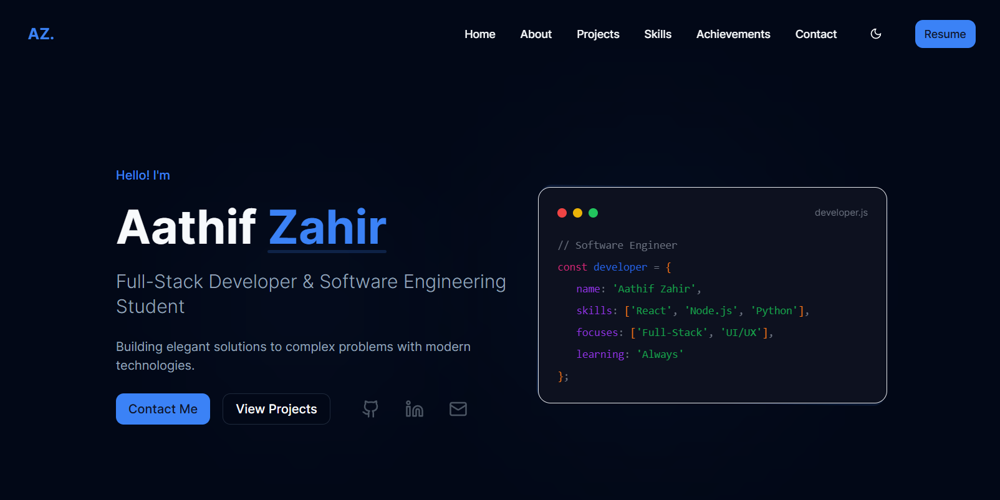

# 🚀 Aathif Zahir – Full Stack Developer Portfolio

[](https://Shashank Poojary.dev)
[](https://github.com/Shashank Poojary/portfolio)


[](LICENSE)

---



## ✨ Overview

Welcome to the personal portfolio of **Aathif Zahir**, a passionate Software Engineering undergraduate with a strong focus on **full-stack web development**. This portfolio is a reflection of my journey, skills, projects, and achievements — built with a modern tech stack and polished UI/UX.

---

## 🎯 Features

- 📌 **Dynamic Content Sections** – About, Skills, Projects, Achievements, and Contact.
- 💡 **Responsive UI** – Optimized across mobile, tablet, and desktop screens.
- 🎨 **Theme Support** – Toggle between Light, Dark, and Purple themes.
- ✨ **Smooth Animations** – Powered by Framer Motion.
- ⚡ **Performance Focused** – Lazy loading with `react-lazy-load-image-component`.
- 📬 **Functional Contact Form** – Integrated with Web3Forms API.

---

## 🛠️ Tech Stack

| Category        | Tech Used                                      |
|----------------|------------------------------------------------|
| Frontend       | React (TypeScript), Vite                       |
| Styling        | Tailwind CSS, Custom & Radix UI Components     |
| State & Routing| React Query, React Router DOM                  |
| Animations     | Framer Motion                                  |
| Form Handling  | Web3Forms API                                  |
| Linting/Format | ESLint, Prettier                               |

---

## 📁 Project Structure

```
src/
├── components/       # Reusable UI components
├── pages/            # Page views (e.g., Home, 404)
├── hooks/            # Custom React hooks
├── data/             # Static config/data (e.g., skills, links)
├── styles/           # Tailwind CSS config
├── App.tsx           # Root component
├── main.tsx          # App entry point
└── index.css         # Global styles
```

---

## ⚙️ Getting Started

> Run this project locally in a few simple steps:

### 🔧 Prerequisites

- Node.js v16+
- npm or yarn

### 🚀 Installation & Development

```bash
# Clone the repository
git clone https://github.com/Shashank Poojary/portfolio.git
cd portfolio

# Install dependencies
npm install

# Start development server
npm run dev
```

Visit: `http://localhost:8080`

### 🏗️ Production Build

```bash
npm run build      # Builds the project
npm run preview    # Serves the production build locally
```

### 🧹 Code Quality

```bash
npm run lint       # Lints your code with ESLint
```

---

## 🌍 Deployment

You can deploy this project on any modern static hosting service like **Vercel**, **Netlify**, or **GitHub Pages**.

### Example: Vercel

```bash
vercel deploy --prod
```

---

## 📬 Contact Me

I’m open to collaborations, opportunities, or just a chat!

- 📧 [aathif@example.com](mailto:aathif@example.com)
- 💼 [LinkedIn](https://linkedin.com/in/Shashank Poojary)
- 💻 [GitHub](https://github.com/Shashank Poojary)

---

> © 2025 Aathif Zahir. Built with ❤️ using React, TypeScript, and Tailwind CSS.
